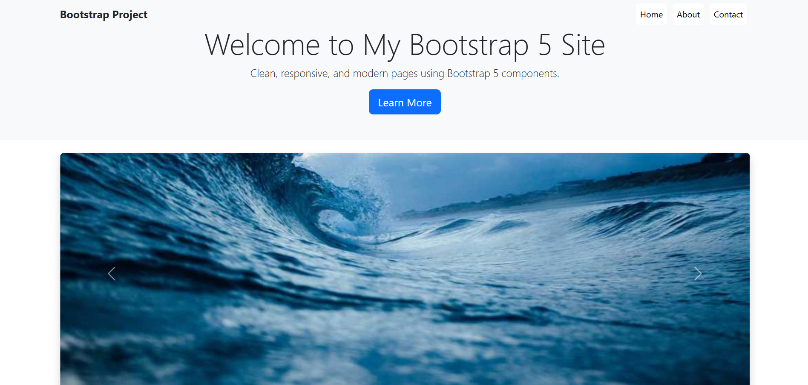

# React + Vite + Bootstrap 5 Project 🚀

This project is a simple **multi-page website** built using **React, Vite, and Bootstrap 5**.  
It demonstrates modern frontend practices including responsive layouts, navigation, carousels, cards, modals, and a sticky footer.

---

## 🌐 Live Demo
👉 [View Live Project](https://your-live-link-here.netlify.app)  

---

## 📌 Features
- Responsive **Navbar** with navigation links (Home, About, Contact)
- **Carousel** showcasing project highlights
- **Cards** with hover effects for interactivity
- **Modal** in the About page with project details
- **Contact form** with Bootstrap styling
- **Sticky Footer** that stays at the bottom

---

## ⚙️ Tech Stack
- **React 18** (UI Library)
- **Vite** (Bundler & Dev Server)
- **Bootstrap 5.3** (Styling & Components)

---
